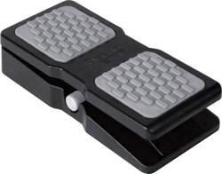
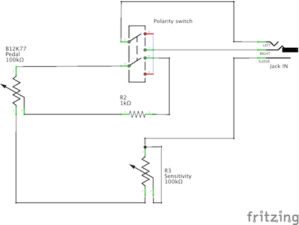
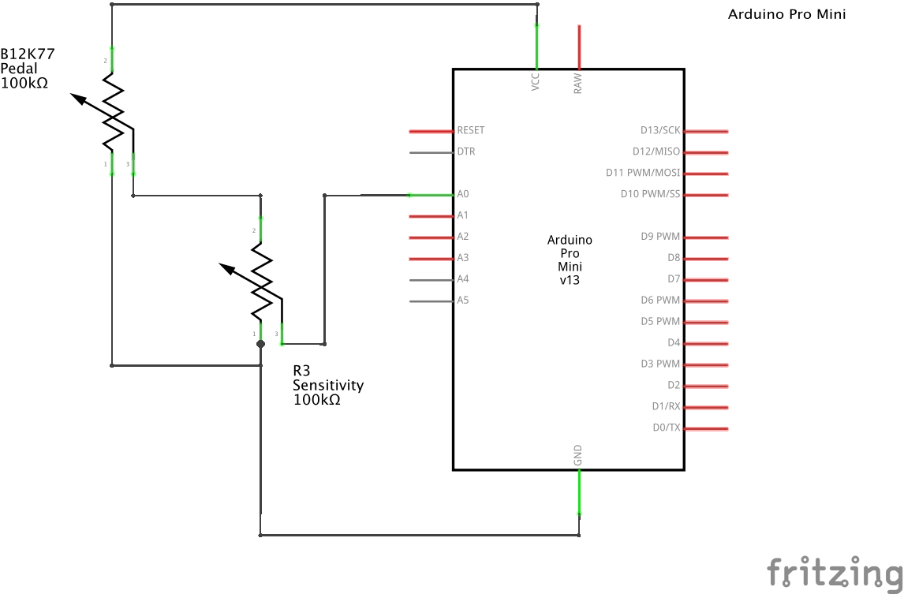
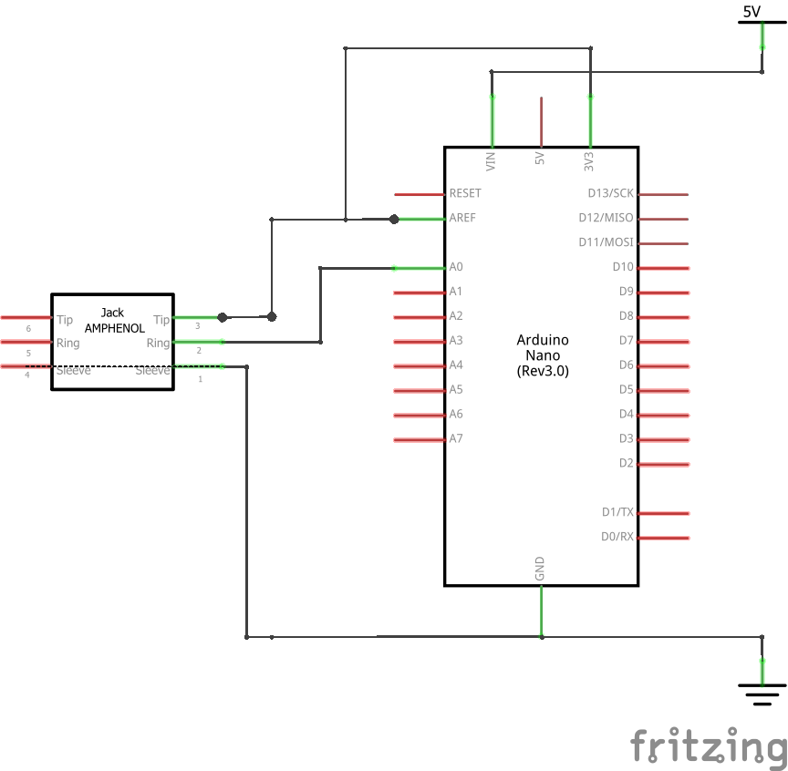

# MidiExpress

MIDIExpress is a MIDI-PC interface originaly designed to connect an expression pedal with only Jack connector to a PC.

Eventually, we decided to create 3 devices:
- a USB-MIDI expression pedal which can be directly connected to a PC.
- a Jack-USB device which is able to connect a Jack pedal to a PC.
- a Jack-DIN device which is able to connect a Jack pedal to a MIDI controller.

## Current status

The project is currently under design. The proof-of-concept has been realized and we are now designing the first device (USB-MIDI expression pedal).

- USB-MIDI expression pedal: under design
- Jack-USB: not started
- Jack-DIN: not started

Status updated on 2019-04-15.

## Licensing

The design and source codes are provided freely under a closed licence. It makes you able to implement the whole project for your own usage but not to sell it.
If you want to use it in a commercial project please contact me at tristan.israel@tibsys.com.

## Cost

Estimated cost of each device is detailed in [this page](costs.md). 

You can buy prebuilt devices by sending an email to tristan.israel@tibsys.com.

## Requirements

- provide PC connectivity to an expression with a Jack connector
- ensure compatibility with all DAWs and MIDI controllers
- provide calibration to the user by discovering values range (learn mode)
- provide the user with a manual definition of the values range (0-128)
- provide the user with a choice of the pedal type (expression or volume) and adapt the MIDI message type used
- provide upgrade capabilities (using USB)

## Presentation

The project consists in an electronic device which is responsible of converting the pedal into a MIDI device. 

### USB-MIDI expression pedal

The USB-MIDI expression pedal is based on an M-AUDIO EX-P expression pedal (around 16 Euros on Amazon). The electronic device (see Jack-USB section) is embedded into the pedal and the original Jack cable is replaced with a USB cable.

This device is powered by USB.

> The original M-Audio EX-P pedal contains a switch for polarity inversion and a potentiometer for the sensitivity.

> We disabled the polarity switch and kept the sensitivity potentiometer to give manual control on the expression range.

### Jack-USB connector

_The design is not fixed yet_

The Jack-USB device is based on an Arduino ATmega32u4 board (Arduino micro like) and a Jack female connector enclosed in an OEM enclosure.

This device is powered by USB.

### Jack-DIN connector

_The design is not fixed yet_

The Jack-DIN device is based on an Arduino ATmega8 processor, a Jack female connector and a DIN male cable.

This device is powered either by USB (_but it is not a USB device_) or batteries (4xAAA).

> Architecture schema will be added later...

## Software design

### Firmware

More details to come.

### Upgrade software

This software is coded in C++-11 with Qt5. It is designed to make some configuration in the Arduino board in order to change or fine-tune its behaviour.

### Configuration software

This software is coded in C++-11 with JUCE and can be used as a standalone application or a VST/AU plugin so you can record different settings in your patches.

## Dependencies

Here comes the list of dependencies for this project.

## Licenses and credits

- Arduino schemas made with [Fritzing](http://fritzing.org/).
- Configuration software made with Qt 5.12.0 community edition.
- Graphics:
    - *to be completed*
