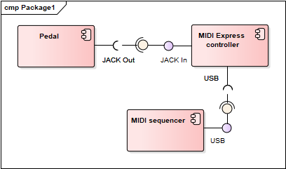

# MidiExpress

MIDIExpress is an USB-MIDI project which offers USB connectivity for expression/volume pedals having only jack connectivity. 

It consists in two subprojects: 
- An Arduino based device (schematics, firmware and software)
- A small configuration application

## Presentation

## Requirements
- provide MIDI USB connectivity to an expression with a Jack connector
- ensure compatibility with all DAWs and MIDI controllers
- behave as a USB device (not a serial device)
- provide calibration to the user by discovering values range
- provide the user with a manual definition of the values range (0-128)
- provide the user with a choice of the pedal type (expression or volume) and adapt the MIDI message type used

## Arduino project

This project contains two parts:
- The Arduino module firmware which makes it a MIDI USB device [see section Firmware](#firmware).
- The Arduino code to behave as a MIDI expression pedal [see section Software](#software).

### Hardware and schematics

Here comes a schematics of the hardware used in this project (based on an Arduino NANO board).

### Firmware

Here comes a description of the firmware sub-project

### Software

Here comes a description of the software sub-project

## Configuration software

This software is coded in C++-11 with Qt5. It is designed to make some configuration in the Arduino board in order to change or fine-tune its behaviour.

## Dependencies

Here comes the list of dependencies for this project.

## Licenses

Here comes the licences of the components used in this project.